# MongoDB学习笔记（一）

最近开始学习nodeJS和服务端相关的知识，既然是服务端就或多或少要和数据库打交道，于是挑了目前比较流行的MongoDB来学习一下。

## 下载安装

不同操作系统有不同的下载安装方法，推荐从[官网下载](https://www.mongodb.com/download-center#community)。

当然，使用mac的同学可以很方便的从Homebrew下载安装(我就是用的这种方法，以下说明均是在mac中使用，其他平台请自行搜索)。

```
sudo brew install mongodb
```

## 运行MongoDB

安装完成以后需要建立一个数据存储目录，MongoDB默认的目录为`/data/db`，于是就需要我们建立这个目录：

```
sudo mkdir -p /data/db
```
然后就可以运行MongoDB程序了：

```
sudo mongod
```

当然你也可以建立其他目录，如：

```
sudo mkdir -p ~/Desktop/database
```

在运行时使用`--dbpath`指定数据存储目录：

```
sudo mongod --dbpath ~/Desktop/database
```

当然，除了数据存储目录还有很多其他的设置项：

* port 指定端口
* dbpath 指定数据存放路径
* logpath 指定日志存放路径
* fork 后台运行（退出终端不会中断运行）

使用的时候类似于下面这样：

```
sudo mongod --fork --port 8080 --dbpath ~/Desktop/database/db --logpath ~/Desktop/database/log 
```

如果每次都要这样写估计会发疯的，所以可以采用配置文件的方式：
首先，建立一个配置文件：

```
vi ~/Desktop/conf/mongodb.conf
```

内容以`<option> = <value>`的格式编写：

```
port = 8080
dbpath = ~/Desktop/database/db
logpath = ~/Desktop/database/log 
fork = true
```

运行的时候只需要简单的指定配置文件就行了：

```
sudo mongod -f ~/Desktop/conf/mongodb.conf
```

## 连接实例

通过上面的过程，我们已经启动了MongoDB服务，现在我们新开一个终端（如果你的配置中fork为false或者没有设置，请不要关闭原先的终端），然后输入连接代码：

```
mongo 
```
然后就会看到一长串运行结果：

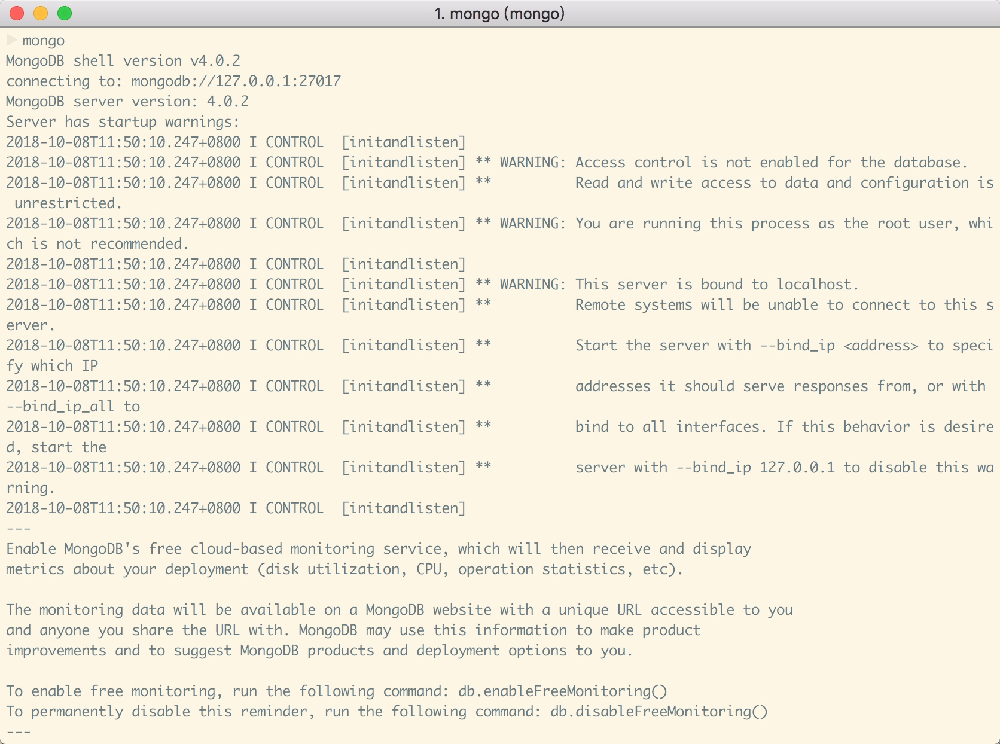

上面这张图是我运行的时候进行的截图，可以看到在`mongo`命令执行的前几行打印出了数据库的版本信息，数据库的链接地址`mongodb://127.0.0.1:27017`，还有很多的警告信息，现在先不用管这些警告，因为并不影响学习阶段使用，这些都是没有开启用户授权和认证功能带来的问题。

当简单的输入`mongo`指令时，会默认的启动`127.0.0.1:27017`的服务，你也可以显示的指定启动的`host`和`port`，如我们之前运行的服务：

```
mongo 127.0.0.1:8080
```

## 数据库CRUD操作

好了，现在我们启动了服务，也链接了数据库实例，这时候就可以进行数据库的CRUD（增删改查）操作数据库了。

但是MongoDB是非关系型数据库，和传统的关系型数据库有很大的不同，所以需要先理解一下其中的概念。

### database数据库

MongoDB中的数据库和传统的数据库在database上的概念是一样的，

#### 查看数据库
在连接上数据库实例后通过命令能查看当前实例中有哪些数据库：

```
show dbs
```
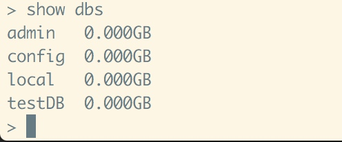

#### 切换数据库

MongoDB中使用`use`命令来切换和'创建'数据库（这里使用引号的原因后面会讲到）。

```
use newDatabase
```
上面的命令表示切换到名为`newDatabase`的数据库，如果这个数据库不存在则创建这个数据库。
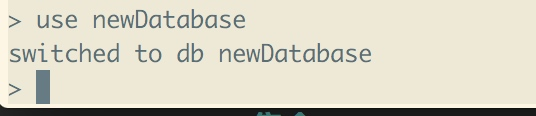
成功切换以后会显示一行信息`switched to db newDatabase`，使用`db`命令能查看当前数据库名称：
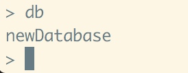

这时候我们使用查看数据库的命令看一下：
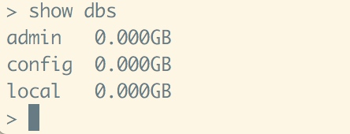
可以发现并没有这条新的数据库记录，要显示我们就需要在这个数据库中创建一个集合:

```
db.createCollection("myCollection")
```
成功后就能看到新的数据库记录了：
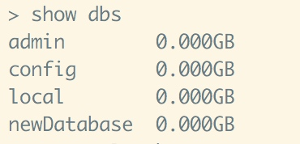

#### 删除数据库

数据库的删除命令是：

```
db.dropDatabase()
```
删除的是当前的数据库（千万别删错了！！！）。
成功删除以后会看到下列结果：
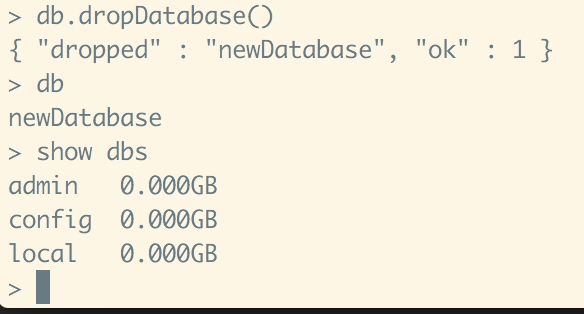

### collection集合

和传统的关系型数据库不一样，MongoDB中没有"表"的概念，取而代之的是"集合"这个概念。

#### 创建集合

之前已经介绍过一个创建集合的命令了：`db.createCollection()`
除了这个命令，还可以使用直接插入文档的方法来创建集合：

```
db.myCollection1.insert({name:"testName",age:23})
```
运行结果如下：
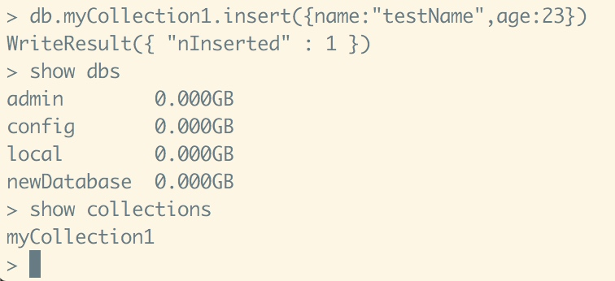

可以看到插入文档不仅创建了文档，也创建了这个文档所在的集合。

#### 删除集合

删除集合和删除数据库有些相似，命令如下：

```
db.COLLECTION_NAME.drop()
```
结果如下：
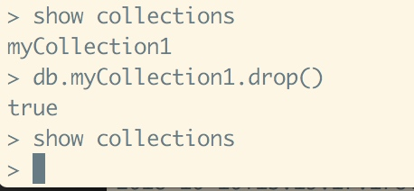

可以看到名为`myCollection1`的集合已经被删除。

### document文档

文档和关系型数据库中的记录有些相似，但是有一个最大的区别：**关系型数据库中，同一张表下的几率所拥有的字段(column)都是一样的，在MongoDB中，同一个集合(collection)中的文档(document)可以拥有不同的域(field)。**

#### 插入(新增)文档

创建文档的命令之前也已经出现过了：

```
db.COLLECTION_NAME.insert({name:"testName",age:23})
```
这里再介绍两条命令：
插入单个文档(v3.2版本之后支持)：

```
db.COLLECTION_NAME.insertOne({})
```
插入多个文档(v3.2版本之后支持)：

```
db.COLLECTION_NAME.insertMany([{},{},{}])
```

可以看出从用法上来说新增的两条命令从语义上更加符合编程习惯，`insert`是个万用方法。

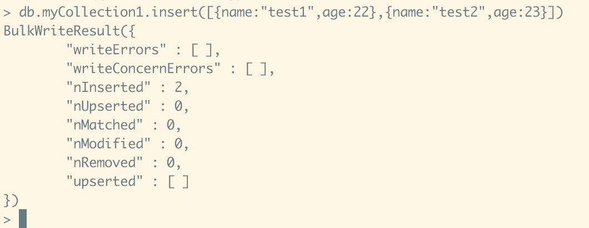

在运行了插入命令后返回信息告诉我们这次命令插入了2条文档。

#### 查询文档

要查看我们的插入结果，可以使用查询文档命令：

```
db.COLLECTION_NAME.find(query, projection)
```

* **query** (可选)查询条件，不传查询所有文档
* **projection** (可选)用来指定返回的键，不传返回所有键值

**全部查询：**

```
db.myCollection1.find()
```

上面这条命令可以查集合中所有的文档：
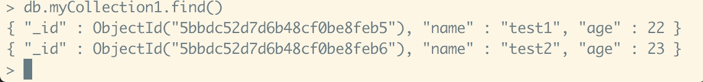

**单条查询：**

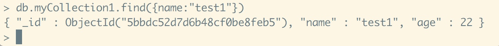

上面的截图显示了我们使用单条查询的方法和结果，这是一种精确查询，但是在实际项目过程中，模糊查询也是占比非常大的一块内容：

举两个例子：

1、查询年龄大于22的所有文档：

```
db.myCollection1.find({age:{$gt:22}})

```
结果如下：

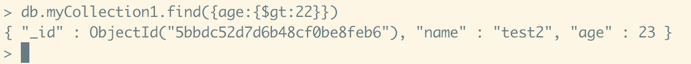

这里的`$gt`是大于的意思，具体逻辑条件可以参考下表：

| 操作 | 格式 |
| --- | --- |
| 小于 | $lt |
| 小于等于 | $lte |
| 大于 | $gt |
| 大于等于 | $gte |
| 不等于 | $ne |

2、查询集合中名字包含`test`的所有文档：

```
db.myCollection1.find({name:/test/})
```

结果如下：

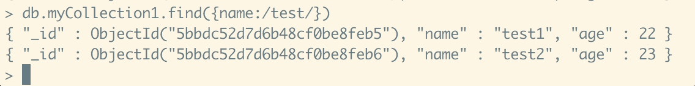

最后补充一点，查询结果如果比较长可以进行格式化方法进行展示：

```
db.myCollection1.find().pretty()
```
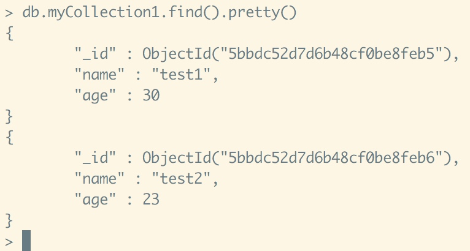

#### 更新文档

更新文档和插入文档有些相似：

```
db.COLLECTION_NAME.update(
    query,
    update,
    {
        upsert
        multi
    }
)
```

* **query** 查询条件
* **update** 更新的对象
* **upsert** （可选）为真，查询为空时插入文档
* **multi** （可选）为真，更新所有符合条件的文档

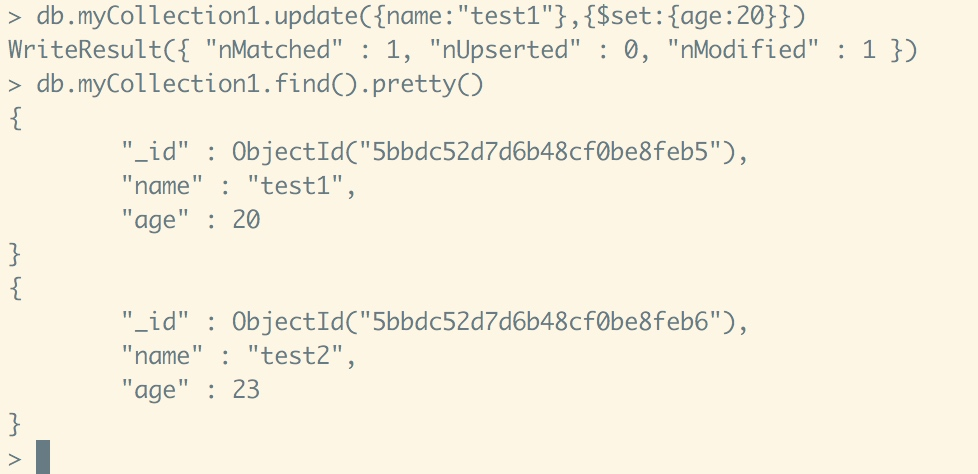

上面的截图中用了`$set`操作符，表示只更新这个字段，如果不加则会将对应的文档替换成`{age:20}`，而不是`{name:"test1",age:20}`。

`update`这个通用方法可以用，但是已经过时，官方提供了`updateOne`和`updateMany`这两个更新文档的方法，具体用法可以去[官方文档](https://docs.mongodb.com/manual/tutorial/update-documents/)上查看。

#### 删除文档

删除文档的方法有：

```
db.COLLECTION_NAME.remove()
db.COLLECTION_NAME.deleteOne()
db.COLLECTION_NAME.deleteMany()
```

从字面意思也能很容易的看出来`deleteOne`是用来删除多个文档的方法，`deleteMany`是用来删除多个文档的方法，要删除所有文档可以使用：

```
db.COLLECTION_NAME.deleteMany({})
```

上面的命令删除了集合下的所有文档，当然也可以直接删除集合来删除所有文档。

`remove`是比较旧的通用方法，运行时需要传入很多参数来控制删除单个文档还是多个文档。

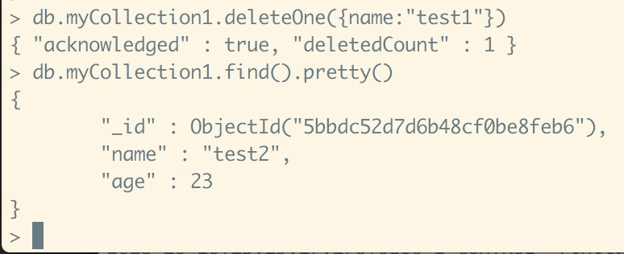

图中就是删除单个文档的效果。

## 总结

这篇文档总结了一下mac下MongoDB如何安装运行，以及基本的数据库CRUD操作，具体使用过程当然会遇上各种其他问题，需要在使用过程中慢慢学习解决。

