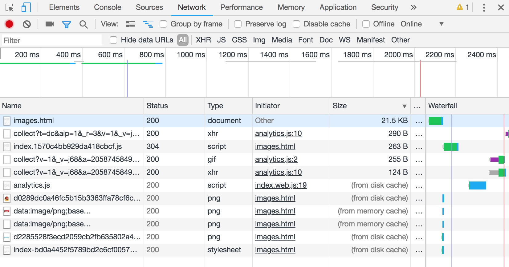
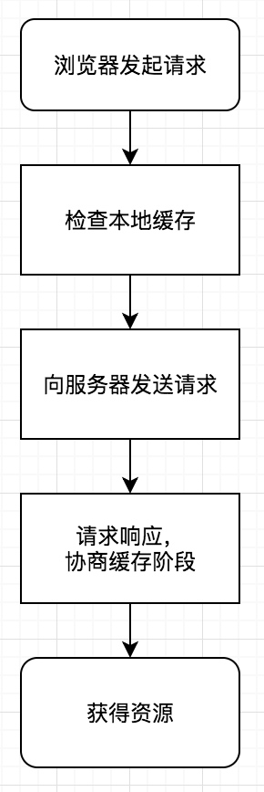
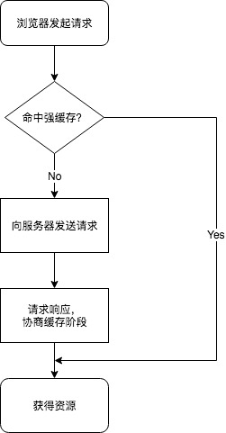

# HTTP缓存

说起HTTP缓存，在开发过程中或多或少都接触过一些，但是并没有深入的去全面了解过，看到HTTP请求头中的字段总是似曾相识，却又不能把来龙去脉全部说清楚，所以这次来做一下整理。

先来看一副图片，是我从浏览器里随便截取的。



可以看出来，这里总共有2中HTTP响应状态码，**200和304**，相信有一定web开发经验的同学都对这两种状态码非常熟悉，这里贴出MDN上的解释，有兴趣的同学可以去查看其它全部的状态码：[HTTP响应代码](https://developer.mozilla.org/zh-CN/docs/Web/HTTP/Status)

>
**200 ok**
请求成功。成功的含义取决于HTTP方法：
GET：资源已被提取并在消息正文中传输。
HEAD：实体标头位于消息正文中。
POST：描述动作结果的资源在消息体中传输。
TRACE：消息正文包含服务器收到的请求消息

>
**304 Not Modified**
如果客户端发送了一个带条件的 GET 请求且该请求已被允许，而文档的内容（自上次访问以来或者根据请求的条件）并没有改变，则服务器应当返回这个状态码。304 响应禁止包含消息体，因此始终以消息头后的第一个空行结尾。

除了响应状态码，还有一个地方引起了我的注意，那就是图中的Size字段。可以看出有些请求是有大小的，而有些则没有，显示的是`from disk cache` 或者是 `from memory cache`。原来浏览器将各种资源分成了**主资源(MainResource)**和**派生资源(SubResource)**，对应不同的资源类型进行了不同的缓存策略。

等等，一下子说了这么多是不是有点乱？我们一点一点来看。

## 缓存流程

我们首先来整理一下，首先是浏览器请求资源的过程：

这里分成两种情况，一种是浏览器第一次请求：


第一次请求资源，先去检查*本地缓存（强缓存）*，由于是第一次，肯定没有命中，所以会进入资源请求阶段，浏览器向资源服务器发起请求，请求得道响应后，浏览器根据响应头中的字段信息执行缓存策略，并把获得的资源进行处理。

然后就是重新请求资源的时候：



每次发起资源请求时，优先匹配**强缓存（本地缓存）**，如果命中强缓存则直接读取缓存中的数据，没有命中，就发出请求，接到响应以后进入**弱缓存（协商缓存）**阶段，如果命中弱缓存则依旧使用本地资源，否则使用新请求的资源。

这里可以看出，HTTP缓存分为两个阶段：**强缓存（本地缓存）**阶段和**弱缓存（协商缓存）**阶段。

## 强缓存（本地缓存）

强缓存是发生在客户端本地的缓存策略，与强缓存相关的HTTP响应头字段为**cache-control、expires、pragma**。

#### cache-control

HTTP/1.1中的字段，全部信息可以查看这里：[Cache-Control](https://developer.mozilla.org/zh-CN/docs/Web/HTTP/Headers/Cache-Control)

**选项：**

可缓存性：

>public：表明响应可以被任何对象（包括：发送请求的客户端，代理服务器，等等）缓存。
private：表明响应只能被单个用户缓存，不能作为共享缓存（即代理服务器不能缓存它）。
no-cache：在释放缓存副本之前，强制高速缓存将请求提交给原始服务器进行验证。
only-if-cached：表明客户端只接受已缓存的响应，并且不要向原始服务器检查是否有更新的拷贝。

到期：

>max-age=\<seconds>：设置缓存存储的最大周期，超过这个时间缓存被认为过期(单位秒)。与Expires相反，时间是相对于请求的时间。
s-maxage=\<seconds>：覆盖max-age 或者 Expires 头，但是仅适用于共享缓存(比如各个代理)，并且私有缓存中它被忽略。
max-stale[=\<seconds>]：表明客户端愿意接收一个已经过期的资源。 可选的设置一个时间(单位秒)，表示响应不能超过的过时时间。
min-fresh=\<seconds>：表示客户端希望在指定的时间内获取最新的响应。

重新验证和重新加载：

>must-revalidate：缓存必须在使用之前验证旧资源的状态，并且不可使用过期资源。
proxy-revalidate：与must-revalidate作用相同，但它仅适用于共享缓存（例如代理），并被私有缓存忽略。

其他：

>no-store：缓存不应存储有关客户端请求或服务器响应的任何内容。
no-transform：不得对资源进行转换或转变。Content-Encoding, Content-Range, Content-Type等HTTP头不能由代理修改。例如，非透明代理可以对图像格式进行转换，以便节省缓存空间或者减少缓慢链路上的流量。 no-transform指令不允许这样做。

**示例：**

```
Cache-Control: no-cache, no-store, must-revalidate // 禁止缓存
Cache-Control: public, max-age=31536000  // 缓存静态资源
```

#### Expires

HTTP/1.0时期的字段，表示缓存过期时间，这是一个GMT绝对时间，即在此时候之后，响应过期。
如果在Cache-Control响应头设置了 "max-age" 或者 "s-max-age" 指令，那么 Expires 头会被忽略。

#### Pargma

HTTP/1.0时期的字段，强制要求缓存服务器在返回缓存的版本之前将请求提交到源头服务器进行验证。
只有一个参数选项：`Pragma: no-cache`。

***建议只在需要兼容 HTTP/1.0 客户端的场合下应用 Pragma 首部。***

### 强缓存命中

强缓存的命中策略就是根据Cache-Control字段或者Expires和Pargma字段来判断资源是否存在、是否过期，存在并且没有过期就命中，直接从本地读取，读取也有两种类型：

```
200(from memory cache)
200(from disk cache)
```

查了一下两者的区别：
>浏览器把资源分为**主资源**和**派生资源**两种类型
所谓主资源就是页面或者下载项之类的资源，而派生资源就是指页面中的图片、脚本、样式表之类的资源。diskCache和memoryCache都是用来缓存派生资源的，那么不同呢？
memoryCache保存在内存中，当浏览器关闭时，内存中的缓存失效，特点是读取速度快。
diskCache保存在磁盘中，就算浏览器关闭，下次再打开时也可以从磁盘中读取缓存数据，但是读取速度相对内存会慢一些（大概2-10ms?），比HTTP请求要快好几倍。

置于浏览器怎么判断资源是放到磁盘中还是内存中，这个问题我找了很多地方都没有一个明确的解释，有人总结了一下，我觉得有些道理：

>先来说说 内存缓存的特点 快(读取快) 时效性(进程死，他也死)

>第一个现象(以图片为例):访问-> 200 -> 退出浏览器再进来-> 200(from disk cache) -> 刷新 -> 200(from memory cache)总结: 会不会是chrome很聪明的判断既然已经从disk拿来了， 第二次就内存拿吧 快。

>第二个现象(以图片为例):只要图片是base64 我看都是from memroy cache。 总结: 解析渲染图片这么费劲的事情，还是做一次然后放到内存吧。 用的时候直接拿。

>第三个现象(以js css为例):个人在做静态测试的发现，大型的js css文件都是直接disk cache总结: chrome会不会说 我擦 你这么大 太JB占地方了。 你就去硬盘里呆着吧。 慢就慢点吧。

>第四个现象:
隐私模式下，几乎都是 from memroy cache.
总结: 隐私模式 是吧。 我不能暴露你东西。还是放到内存吧。 你关，我死。

## 弱缓存（协商缓存）

当强缓存没有命中，就到了弱缓存阶段了，为什么会有这个阶段呢？因为有些资源文件虽然过期了，但是并不意味着发生了修改，弱缓存阶段要处理的就是这种情况，区分哪些资源是真的发生了修改，从而最大化的减少资源请求。弱缓存发生在服务器端。

与弱缓存阶段有关的HTTP头部总共有两组：

#### 第一组
**Last-Modified**
*响应头字段*，在请求响应后返回，包含源头服务器认定的资源做出修改的日期及时间。

```
Last-Modified: Wed, 21 Oct 2015 07:28:00 GMT
```

**If-Modified-Since**
*请求头字段*，值为**Last-Modified**字段返回的值，服务器只在所请求的资源在给定的日期时间之后对内容进行过修改的情况下才会将资源返回，状态码为 200  。如果请求的资源从那时起未经修改，那么返回一个不带有消息主体的  304  响应，而在 Last-Modified 首部中会带有上次修改时间，**用在 GET 或 HEAD 请求中**。

```
If-Modified-Since: Wed, 21 Oct 2015 07:28:00 GMT
```

**If-Unmodified-Since**
*请求头字段*，值为**Last-Modified**字段返回的值，使得当前请求成为条件式请求：只有当资源在指定的时间之后没有进行过修改的情况下，服务器才会返回请求的资源，如果所请求的资源在指定的时间之后发生了修改，那么会返回 412 (Precondition Failed) 错误，**用在 POST、PUT 或其他 non-safe 方法的请求中**。

```
If-Unmodified-Since: Wed, 21 Oct 2015 07:28:00 GMT
```

总结一下第一组字段，都是时间格式，服务器把资源的修改时间放在**Last-Modified**字段中返回，后续客户端在请求资源时在**If-Modified-Since**字段中携带这个时间，或者在主动更新服务器资源时在**If-Unmodified-Since**字段中携带这个时间，服务器会根据请求中携带的时间决定如何返回。

#### 第二组
**ETag**
*响应头字段*，是资源的特定版本的标识符，类似于指纹，只要这个文件发生了改变，这个标志就会发生变化。

```
ETag: "33a64df551425fcc55e4d42a148795d9f25f89d4"    //  强验证器
ETag: W/"0815"                                      //  弱验证器
```

**If-None-Match**
*请求头字段*，值为**ETag**字段返回的值，服务器接收到该字段后去与服务器上的资源的**ETag**进行匹配，没有匹配到才返回请求的资源和200的响应状态码，要是匹配到了就返回响应码304，并返回一个空的响应体，告诉客户端缓存版本可用（新鲜）。

```
If-None-Match: "33a64df551425fcc55e4d42a148795d9f25f89d4"
```

**If-Match**
*请求头字段*，值为**ETag**字段返回的值，当需要更新服务器上的资源时使用该字段，一旦匹配失败，说明服务器上的资源已经被编辑，返回响应码412，可以确保资源更新时不会相互覆盖（和svn的更新机制有点像）。

```
If-Match: "33a64df551425fcc55e4d42a148795d9f25f89d4"
```

第二组与第一组字段看上去功能很相似，只不过第一组用的是时间，第二组用的是内容hash，***第二组字段的优先级要高于第一组字段（ETag高于Last-Modified）***。

## 用户刷新行为与缓存

浏览器有三种不同的刷新行为：

* 开新页面：打开新tab或者窗口，访问页面
* 普通刷新：点击刷新按钮、地址栏回车、CMD + R (mac上)、F5 (windows上)
* 强制刷新：CMD + Shift + R (mac上)、 ctrl + F5 (windows上)、Chrome长按刷新按钮，选择硬性重新加载

这三种刷新行为有什么区别呢？

#### 开新页面

请求头不带缓存相关字段，如果本地缓存版本有效，从缓存读取，不发请求，也就是强缓存和弱缓存同时生效。

#### 普通刷新

使强缓存失效，重新发起请求，但是弱缓存依旧有效。

#### 强制刷新

使强缓存和弱缓存同时失效，几乎所有的资源都会重新请求，就和第一次打开页面一样。

*PS：当浏览器设置了Disable cache时，所有的请求都会打上*

```
Cache-Control:no-cache
Pragma:no-cache
```
*相当于全部走强制刷新*

## 参考资料

[浏览器是根据什么决定from disk cache 与 from memory cache？](https://www.zhihu.com/question/64201378)
[memoryCache和diskCache流程详解](https://blog.csdn.net/m632587166/article/details/50732205)
[当我们在谈论HTTP缓存时我们在谈论什么](https://juejin.im/post/5b1b563f5188257d9940e402?utm_source=gold_browser_extension)
[HTTP缓存](https://developer.mozilla.org/zh-CN/docs/Web/HTTP/Caching_FAQ)


